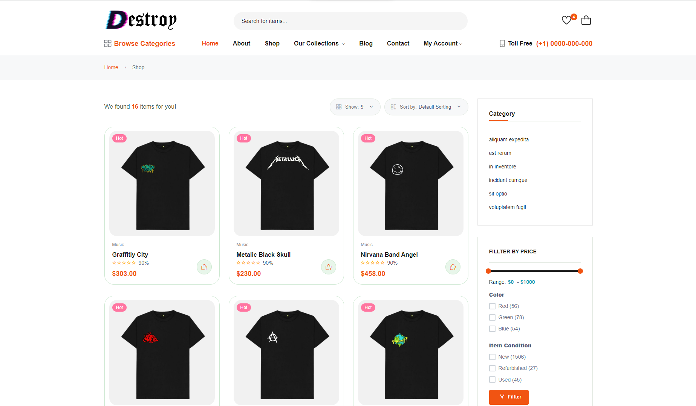
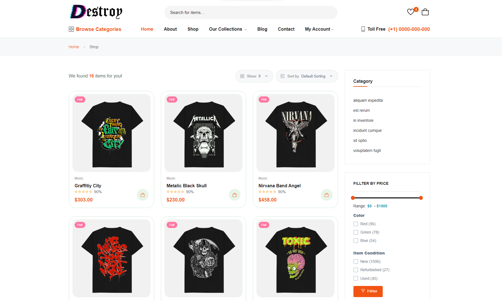

# Clothes E-Commerce

Ini adalah website E-Commerce yang saya buat dengan tema Toko Pakaian. Untuk framework yang saya gunakan yaitu laravel.


## Screenshots





## Run Locally

Clone the project

```bash
  git clone git@github.com:anharsaja/clothes_E-Commerce.git
```

Go to the project directory

```bash
  cd my-project
```

Buat database dan kaitkan pada .ENV
```SQL
  php artisan migrate
```

Install dependencies

```bash
  npm install
```
```bash
  npm run dev
```

Start the server

```bash
  php artisan serve
```

## Demo

http://localhost:8000


## Install any library

* Livewire
```Powershell
  composer require livewire/livewire
```


* Breeze
```Powershell
  composer require laravel/breeze:1.9.4
  php artisan breeze:install
  npm install
  npm run dev
```

* Turbolinks

Add the turbolinks package to your application:
```Powershell
  npm install --save turbolinks
```
Require and start Turbolinks in your JavaScript bundle:
```code
  var Turbolinks = require("turbolinks")
      Turbolinks.start()
```
